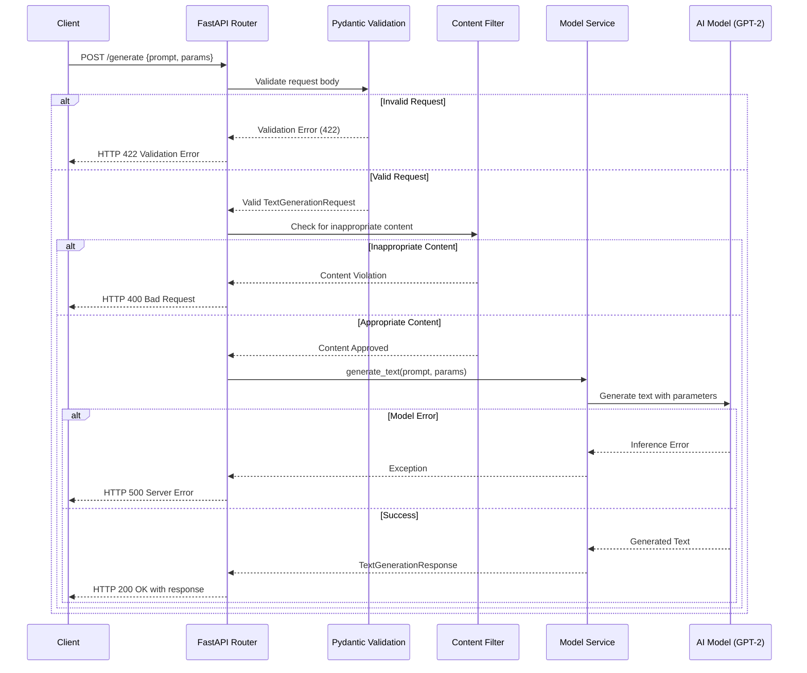

# Serving AI Models with FastAPI: 


## Integrating and Serving AI Models with FastAPI

**Objective**: Build a FastAPI service that integrates a generative AI model (e.g., text generation with GPT-2) and serves it via a REST API.

**Libs**:
- Python 3.9+
- FastAPI (for the API framework)
- Uvicorn (ASGI server for running FastAPI)
- Hugging Face Transformers (for AI model integration)
- Torch (for model computation)
- Pydantic (for request/response validation)
- Optional: Pytest (for testing)

**Tools**:
- Terminal for running commands
- Code editor (e.g., VS Code)
- Virtual environment (to keep dependencies clean)


 **How to run it ?**:

 - Activate the virtual environment:
 ```bash
  venv\Scripts\activate
 ```

- Start the FastAPI server:
```bash
    uvicorn main:app --reload
```

- Once the server is running, you can access the API documentation at http://127.0.0.1:8000/docs in your web browser.

---
### Request Flow Diagram

The following diagram illustrates the detailed flow of a text generation request through each component of the system:



**Key Component**

- **Client**: External system or user sending HTTP requests to the API
- **FastAPI Router**: Handles routing of HTTP requests to appropriate endpoint handlers
- **Pydantic Validation**: Validates incoming request data against defined schemas
- **Content Filter**: Checks text prompts for inappropriate content
- **Model Service**: Manages AI model operations and business logic
- **AI Model (GPT-2)**: The actual transformer model that generates text responses
---

## Step 1: Project Environment


**Instructions**:
1. Create a project directory and navigate to it:
   ```bash
   mkdir ai-model-service
   cd ai-model-service
   ```

2. Set up a virtual environment:
   ```bash
   python -m venv venv
   source venv/bin/activate  # Windows: venv\Scripts\activate
   ```

3. Install required packages:
   ```bash
   pip install fastapi uvicorn pydantic transformers torch
   ```

4. Save dependencies to a `requirements.txt` file:
   ```bash
   pip freeze > requirements.txt
   ```

**What You Get**:
```
fastapi
uvicorn
pydantic
transformers
torch
```

---

## Step 2: Define Data Models

**Why**: Pydantic models  defines the structure of your API’s inputs and outputs to ensure consistency and catch errors early.

**Instructions**:
1. Create a `models.py` file.
2. Define Pydantic models for the text generation request and response.

**Code Example**:
```python
from pydantic import BaseModel, Field
from typing import Optional

class TextGenerationRequest(BaseModel):
    prompt: str = Field(..., min_length=1, max_length=500, description="Input prompt for text generation")
    max_length: Optional[int] = Field(50, ge=10, le=200, description="Maximum length of generated text")

class TextGenerationResponse(BaseModel):
    generated_text: str = Field(..., description="Text generated by the AI model")
    model_name: str = Field(..., description="Name of the AI model used")
```

**Taste Test**:
- `TextGenerationRequest` validates that the prompt is non-empty and under 500 characters, with an optional `max_length` between 10 and 200.
- `TextGenerationResponse` ensures the API returns the generated text and model name.

---

## Step 3: Integrate the AI Model


**Instructions**:
1. Create a `main.py` file.
2. Set up a FastAPI app and integrate a Hugging Face model (e.g., GPT-2) using the `transformers` library. This single file will contain all our logic, including model loading, error handling, and logging.

**Code Example**:
```python
from fastapi import FastAPI, HTTPException
from models import TextGenerationRequest, TextGenerationResponse
from transformers import pipeline
import logging
import time

# Configure logging
logging.basicConfig(level=logging.INFO)
logger = logging.getLogger(__name__)

app = FastAPI(title="AI Model Service", version="1.0.0")
FORBIDDEN_WORDS = ["hate", "violence"]

# Load model with timing
start_time = time.time()
logger.info("Loading AI model...")
generator = pipeline("text-generation", model="gpt2")
logger.info(f"Model loaded in {time.time() - start_time:.2f} seconds")

@app.post("/generate", response_model=TextGenerationResponse)
async def generate_text(request: TextGenerationRequest):
    if any(word in request.prompt.lower() for word in FORBIDDEN_WORDS):
        logger.warning(f"Inappropriate prompt detected: {request.prompt}")
        raise HTTPException(status_code=400, detail="Prompt contains inappropriate content")

    try:
        logger.info(f"Generating text for prompt: {request.prompt}")
        result = generator(request.prompt, max_length=request.max_length, num_return_sequences=1)
        generated_text = result[0]["generated_text"]

        return TextGenerationResponse(
            generated_text=generated_text,
            model_name="gpt2"
        )
    except Exception as e:
        logger.error(f"Model inference failed: {str(e)}")
        raise HTTPException(status_code=500, detail=f"Model inference failed: {str(e)}")
```


- The `pipeline("text-generation", model="gpt2")` loads a pre-trained GPT-2 model for text generation.
- The `/generate` endpoint accepts a `TextGenerationRequest` and returns a `TextGenerationResponse`.
- Error handling with `HTTPException` ensures the API gracefully handles model failures.
- The model is loaded once at startup to improve performance.
- Logging is included to track model loading and inference.

---

## Step 4: Run the FastAPI Server

Running the server lets you test your API and explore its interactive documentation.

**Instructions**:
1. Start the FastAPI server with Uvicorn:
   ```bash
   uvicorn main:app --reload
   ```

2. Open `http://127.0.0.1:8000/docs` in your browser to access the Swagger UI for testing.

**Try It Out**:
Send a test request with `curl`:
```bash
curl -X POST "http://127.0.0.1:8000/generate" -H "Content-Type: application/json" -d \'\'\'{"prompt": "The future of AI is", "max_length": 50}\'\'\'
```

**Expected Dish**:
```json
{
  "generated_text": "The future of AI is bright, with machines learning to think and create like humans...",
  "model_name": "gpt2"
}
```

---

## Step 5: Basic Error Handling

Error handling to makes sure your service is robust and to prevents unexpected crashes.

**Instructions**:
The `main.py` file already includes basic input validation. It checks for inappropriate content by using a simple list of forbidden words. If a forbidden word is found, it returns a 400 error.

**Taste Test**:
- Prompts containing “hate” or “violence” trigger a 400 error.
- Pydantic’s built-in validation ensures the prompt isn’t empty and `max_length` is within bounds.

---

## Step 6: Test the Service

Testing ensures your service works as expected.

**Instructions**:
1. Install testing tools:
   ```bash
   pip install pytest httpx
   ```

2. Create a `test_main.py` file to test the API.

**Code Example**:
```python
import pytest
from fastapi.testclient import TestClient
from main import app

client = TestClient(app)

def test_generate_text_success():
    response = client.post("/generate", json={"prompt": "The future of AI", "max_length": 50})
    assert response.status_code == 200
    assert "generated_text" in response.json()
    assert response.json()["model_name"] == "gpt2"

def test_generate_text_invalid_prompt():
    response = client.post("/generate", json={"prompt": "", "max_length": 50})
    assert response.status_code == 422  # Pydantic validation error

def test_generate_text_forbidden_words():
    response = client.post("/generate", json={"prompt": "I hate this", "max_length": 50})
    assert response.status_code == 400
    assert "inappropriate content" in response.json()["detail"]
```

3. Run the tests:
   ```bash
   pytest test_main.py
   ```

**Expected Result**:
```
===================================== test session starts ======================================
collected 3 items

test_main.py ...                                                                 [100%]

===================================== 3 passed in 0.15s ======================================
```

---

## Step 7: Optimize Model Serving (Efficient Loading)

Loading the AI model efficiently to saves time and resources.

**Instructions**:
The model is already loaded once at startup in `main.py` (with `generator = pipeline(...)` outside the endpoint). This avoids repeated loading for each request, which significantly improves performance. For large models, you might consider using a dedicated model server like Triton or a cloud-based API to further reduce memory usage and improve scalability.

**Flavor Notes**:
- Logging in `main.py` tracks model load time and inference events for debugging.
- Loading the model at startup is a key optimization for performance.

---

## Step 8: Deploy the Service

Deployment makes your service accessible to users.

**Instructions**:
1. Create a `Procfile` for deployment (e.g., on Render):
```
web: uvicorn main:app --host 0.0.0.0 --port $PORT
```

2. Deploy to a platform like Render, ensuring `requirements.txt` is included.
3. (Optional) Use environment variables for configuration (e.g., model name or API keys).

**Command** (Render CLI example):
```bash
render deploy
```

---

##  Tips
- **Optimize Model Size**: Use a smaller model (e.g., `distilgpt2`) for faster loading in development.
- **Scale with APIs**: For production, consider cloud-based AI APIs to offload model hosting.
- **Monitor Performance**: Use tools like Prometheus or New Relic to track API latency and errors.
- **Secure Secrets**: Store sensitive data (e.g., API keys) in a `.env` file with `python-dotenv`.

---

## Project Structure
```
ai-model-service/
├── main.py
├── models.py
├── test_main.py
├── requirements.txt
├── Procfile
└── venv/
```

---

