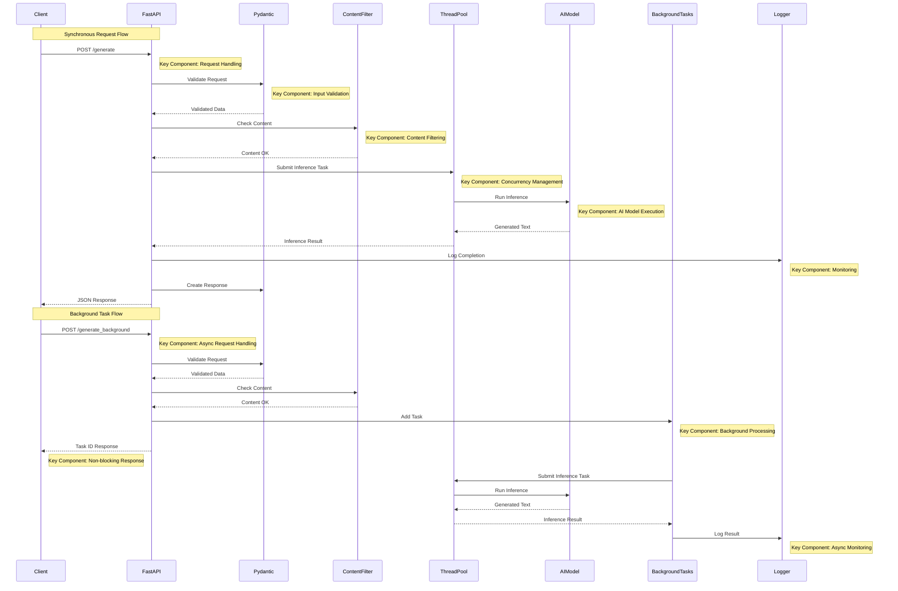

# Concurrency in AI Workloads with FastAPI


## Background
AI workloads, like text generation or image processing, can be computationally intensive, often requiring significant CPU or GPU resources. FastAPI, built on Python’s `asyncio` and Starlette, excels at handling concurrent requests thanks to its asynchronous architecture. This will focuses on leveraging async/await to manage multiple AI model inferences simultaneously, reducing latency and improving throughput. This project will use a text generation model (Hugging Face’s GPT-2) as our example, but the principles apply to any AI workload. This guide assumes you’re familiar with Python, FastAPI basics, and AI model integration. This project will introduce concurrency concepts like async endpoints, background tasks, and thread pools to handle AI workloads efficiently.

**Why Concurrency Matters**:
- **Scalability**: Handle multiple users without blocking the server.
- **Performance**: Reduce latency for AI inference by processing requests concurrently.
- **Resource Efficiency**: Optimize CPU/GPU usage for compute-heavy tasks.
- **Real-World Use**: Power chatbots, content generators, or real-time AI apps.


---

## Achieving Concurrency in AI Workloads with FastAPI

**Objective**: Build a FastAPI service that handles concurrent text generation requests using async endpoints, background tasks, and thread pools for CPU-bound AI workloads.

**Libs**:
- Python 3.9+ (the base for our recipe)
- FastAPI (for async API framework)
- Uvicorn (ASGI server to run FastAPI)
- Hugging Face Transformers (for the AI model)
- Torch (for model computation)
- Pydantic (for type-safe validation)
- `concurrent.futures` (for thread pools)
- Optional: Pytest (for testing)

**Tools**:
- Terminal or command line
- Code editor (e.g., VS Code)
- Virtual environment (to keep dependencies clean)


---

### Request Flow Diagram



**Key Component**

- **Request Handling**: FastAPI's async endpoints that manage the complete HTTP request lifecycle with proper routing and response formatting.
- **Input Validation**: Pydantic models that enforce data constraints and prevent malformed data from reaching application logic.
- **Content Filtering**: System that screens input text for inappropriate content and rejects prohibited requests.
- **Concurrency Management**: ThreadPoolExecutor that offloads CPU-bound tasks from the async event loop to prevent resource exhaustion.
- **AI Model Execution**: Efficient loading and execution of the GPT-2 model with proper parameter management and error handling.
- **Monitoring**: Comprehensive logging system that tracks request IDs and performance metrics throughout the request lifecycle.
- **Async Request Handling**: Implementation of FastAPI's async/await pattern to maintain event loop responsiveness during processing.
- **Background Processing**: FastAPI's BackgroundTasks for queuing long-running operations independent of the request/response cycle.
- **Non-blocking Response**: Immediate acknowledgment system that returns request IDs while processing continues in the background.

---
## Step 1: Project Environment

**Instructions**:
1. Create a project directory:
   ```bash
   mkdir ai-concurrency-service
   cd ai-concurrency-service
   ```

2. Set up a virtual environment:
   ```bash
   python -m venv venv
   source venv/bin/activate  # Windows: venv\Scripts\activate
   ```

3. Install required packages:
   ```bash
   pip install fastapi uvicorn pydantic transformers torch pytest httpx
   ```

4. Save dependencies to a `requirements.txt` file:
   ```bash
   pip freeze > requirements.txt
   ```

**What You Get**:

```
fastapi==0.115.0
uvicorn==0.30.6
pydantic==2.9.2
transformers
torch==2.6.0
pytest==8.3.2
httpx==0.27.2
```

**Pro Tip**: The `requirements.txt` ensures consistent setups across development and production.

---

## Step 2: Define Pydantic Models

Pydantic models ensure type-safe inputs and outputs for concurrent requests.

**Instructions**:
1. Create a `models.py` file.
2. Define models for text generation requests and responses.

**Code Example**:
```python
from pydantic import BaseModel, Field
from typing import Optional

class TextGenerationRequest(BaseModel):
    prompt: str = Field(..., min_length=1, max_length=500, description="Input prompt for text generation")
    max_length: Optional[int] = Field(50, ge=10, le=200, description="Maximum length of generated text")

class TextGenerationResponse(BaseModel):
    generated_text: str = Field(..., description="Text generated by the AI model")
    model: str = Field(..., description="Name of the AI model used")
    request_id: str = Field(..., description="Unique ID for the request")
```


- `TextGenerationRequest` validates the prompt and `max_length`.
- `TextGenerationResponse` includes a `request_id` to track concurrent requests.

---

## Step 3: Async Endpoint with Thread Pool

AI model inference is CPU-bound, so we’ll use a thread pool to offload it from the async event loop, allowing FastAPI to handle multiple requests concurrently.

**Instructions**:
1. Create a `main.py` file.
2. Set up a FastAPI app with an async endpoint that uses a thread pool for model inference.

**Code Example**:
```python
import asyncio
import uuid
import logging
from contextlib import asynccontextmanager
from concurrent.futures import ThreadPoolExecutor

from fastapi import FastAPI, HTTPException
from models import TextGenerationRequest, TextGenerationResponse
from transformers import pipeline

# Configure logging and lifespan manager
logging.basicConfig(level=logging.INFO)
logger = logging.getLogger(__name__)

@asynccontextmanager
async def lifespan(app: FastAPI):
    logger.info("FastAPI service is starting up.")
    yield
    logger.info("Shutting down thread pool...")
    executor.shutdown(wait=True)
    logger.info("Thread pool shutdown complete.")

app = FastAPI(title="Concurrent AI Service", version="1.0.0", lifespan=lifespan)

# Initialize model and thread pool
generator = pipeline("text-generation", model="gpt2")
executor = ThreadPoolExecutor(max_workers=4)

def run_model_inference(prompt: str, max_length: int) -> str:
    """Run model inference in a separate thread."""
    result = generator(prompt, max_length=max_length, num_return_sequences=1)
    return result[0]["generated_text"]

@app.post("/generate", response_model=TextGenerationResponse)
async def generate_text(request: TextGenerationRequest):
    request_id = str(uuid.uuid4())
    logger.info(f"Processing request {request_id} with prompt: {request.prompt}")
    
    try:
        # Get the current event loop
        loop = asyncio.get_running_loop()
        # Offload CPU-bound model inference to thread pool
        generated_text = await loop.run_in_executor(
            executor, run_model_inference, request.prompt, request.max_length
        )
        return TextGenerationResponse(
            generated_text=generated_text,
            model=generator.model.config.model_type,
            request_id=request_id
        )
    except Exception as e:
        logger.error(f"Request {request_id} failed: {str(e)}")
        raise HTTPException(status_code=500, detail=f"Model inference failed: {str(e)}")
```

- `ThreadPoolExecutor` offloads CPU-bound model inference, keeping the async event loop free.
- `asyncio.get_running_loop()` correctly gets the event loop inside the async function.
- `loop.run_in_executor` runs the synchronous `run_model_inference` function in a thread.
- The `lifespan` context manager safely manages the thread pool lifecycle.

---

## Step 4: Run the FastAPI Server

Running the server lets you test concurrency to see how it holds up under pressure.

**Instructions**:
1. Start the server with Uvicorn:
   ```bash
   uvicorn main:app --host 0.0.0.0 --port 8000
   ```

2. Visit `http://127.0.0.1:8000/docs` for Swagger UI to test the API.

**Try It Out**:
Test concurrency by sending multiple requests simultaneously using `curl` or a tool like `ab` (Apache Benchmark):
```bash
# Send 10 concurrent requests
ab -n 10 -c 5 -p post_data.json -T application/json http://127.0.0.1:8000/generate
```

**Sample `post_data.json`**:
```json
{"prompt": "The future of AI is", "max_length": 50}
```

**Expected Result** (example response):
```json
{
  "generated_text": "The future of AI is bright, with machines creating innovative solutions...",
  "model": "gpt2",
  "request_id": "123e4567-e89b-12d3-a456-426614174000"
}
```

**Pro Tip**: For production, you might run Uvicorn with multiple workers: `uvicorn main:app --workers 4`.

---

## Step 5: Content Filtering and Logging

Robust error handling and logging ensure your service handles concurrent requests gracefully.

**Instructions**:
1. Update `main.py` to add content filtering for inappropriate prompts.
2. Enhance logging to track concurrent requests.

**Code Example** (Updated `main.py`):
```python
import asyncio
import uuid
import logging
from contextlib import asynccontextmanager
from concurrent.futures import ThreadPoolExecutor

from fastapi import FastAPI, HTTPException
from models import TextGenerationRequest, TextGenerationResponse
from transformers import pipeline

# Configure logging and lifespan manager
logging.basicConfig(level=logging.INFO)
logger = logging.getLogger(__name__)

@asynccontextmanager
async def lifespan(app: FastAPI):
    logger.info("FastAPI service is starting up.")
    yield
    logger.info("Shutting down thread pool...")
    executor.shutdown(wait=True)
    logger.info("Thread pool shutdown complete.")

app = FastAPI(title="Concurrent AI Service", version="1.0.0", lifespan=lifespan)

generator = pipeline("text-generation", model="gpt2")
executor = ThreadPoolExecutor(max_workers=4)
FORBIDDEN_WORDS = ["hate", "violence"]

def run_model_inference(prompt: str, max_length: int) -> str:
    result = generator(prompt, max_length=max_length, num_return_sequences=1)
    return result[0]["generated_text"]

@app.post("/generate", response_model=TextGenerationResponse)
async def generate_text(request: TextGenerationRequest):
    request_id = str(uuid.uuid4())
    logger.info(f"Processing request {request_id} with prompt: {request.prompt}")
    
    # Content filtering
    if any(word in request.prompt.lower() for word in FORBIDDEN_WORDS):
        logger.warning(f"Request {request_id} rejected: Inappropriate content")
        raise HTTPException(status_code=400, detail="Prompt contains inappropriate content")
    
    try:
        loop = asyncio.get_running_loop()
        generated_text = await loop.run_in_executor(
            executor, run_model_inference, request.prompt, request.max_length
        )
        logger.info(f"Request {request_id} completed successfully")
        return TextGenerationResponse(
            generated_text=generated_text,
            model=generator.model.config.model_type,
            request_id=request_id
        )
    except Exception as e:
        logger.error(f"Request {request_id} failed: {str(e)}", exc_info=True)
        raise HTTPException(status_code=500, detail=f"Model inference failed: {str(e)}")
```

- Prompts with “hate” or “violence” are rejected with a 400 error.
- Logging tracks each request’s lifecycle, aiding debugging in concurrent scenarios.

---

## Step 6: Test Concurrency

Testing ensures your service handles concurrent requests correctly.

**Instructions**:
1. Create a `test_main.py` file to test the API under concurrent loads.
2. Use `httpx` for async HTTP requests.

**Code Example**:
```python
import pytest
import httpx
from fastapi.testclient import TestClient
from main import app
import asyncio

client = TestClient(app)

@pytest.mark.asyncio
async def test_generate_text_concurrent():
    async with httpx.AsyncClient(app=app, base_url="http://test") as async_client:
        # Send 5 concurrent requests
        tasks = [
            async_client.post("/generate", json={"prompt": f"Test prompt {i}", "max_length": 50})
            for i in range(5)
        ]
        responses = await asyncio.gather(*tasks)
        
        for response in responses:
            assert response.status_code == 200
            assert "generated_text" in response.json()
            assert response.json()["model"] == "gpt2"
            assert "request_id" in response.json()

def test_generate_text_invalid_prompt():
    response = client.post("/generate", json={"prompt": "", "max_length": 50})
    assert response.status_code == 422  # Pydantic validation error

def test_generate_text_forbidden_words():
    response = client.post("/generate", json={"prompt": "I hate this", "max_length": 50})
    assert response.status_code == 400
    assert "inappropriate content" in response.json()["detail"]
```

3. Run the tests:
   ```bash
   pytest test_main.py
   ```

**Expected Result**:
```
===================================== test session starts ======================================
collected 3 items

test_main.py ...                                                                 [100%]

===================================== 3 passed in 2.10s ======================================
```

**Pro Tip**: The async test simulates concurrent requests, ensuring the thread pool handles them efficiently.

---

## Step 7: Deploy the Service

Deployment makes your concurrent AI service accessible.

**Instructions**:
1. Create a `Procfile` for deployment (e.g., on Render):

   ```
   web: uvicorn main:app --host 0.0.0.0 --port $PORT --workers 4
   ```

2. Deploy to a platform like Render, ensuring `requirements.txt` is included.
3. Configure environment variables for production settings.

**Command** (Render CLI example):
```bash
render deploy
```

**Tip**: Match the number of Uvicorn workers to your server’s CPU cores for optimal concurrency.

---

## Step 8: Background Tasks for Long-Running Inference

Background tasks handle long-running AI workloads without blocking the API.

**Instructions**:
1. Update `main.py` to add a background task endpoint for long-running text generation.
2. Use FastAPI’s `BackgroundTasks` to queue inference tasks.

**Code Example** (Final `main.py`):
```python
import asyncio
import uuid
import logging
from contextlib import asynccontextmanager
from concurrent.futures import ThreadPoolExecutor

from fastapi import FastAPI, HTTPException, BackgroundTasks
from models import TextGenerationRequest, TextGenerationResponse
from transformers import pipeline

@asynccontextmanager
async def lifespan(app: FastAPI):
    logger.info("FastAPI service is starting up.")
    yield
    logger.info("Shutting down thread pool...")
    executor.shutdown(wait=True)
    logger.info("Thread pool shutdown complete.")

logging.basicConfig(level=logging.INFO)
logger = logging.getLogger(__name__)
app = FastAPI(title="Concurrent AI Service", version="1.0.0", lifespan=lifespan)

generator = pipeline("text-generation", model="gpt2")
executor = ThreadPoolExecutor(max_workers=4)
FORBIDDEN_WORDS = ["hate", "violence"]

def run_model_inference(prompt: str, max_length: int) -> str:
    result = generator(prompt, max_length=max_length, num_return_sequences=1)
    return result[0]["generated_text"]

def background_inference(prompt: str, max_length: int, request_id: str):
    """Run inference in background and log result."""
    try:
        result = run_model_inference(prompt, max_length)
        logger.info(f"Background task {request_id} completed: {result[:50]}...")
    except Exception as e:
        logger.error(f"Background task {request_id} failed: {str(e)}")

@app.post("/generate", response_model=TextGenerationResponse)
async def generate_text(request: TextGenerationRequest):
    request_id = str(uuid.uuid4())
    logger.info(f"Processing request {request_id} with prompt: {request.prompt}")
    if any(word in request.prompt.lower() for word in FORBIDDEN_WORDS):
        raise HTTPException(status_code=400, detail="Prompt contains inappropriate content")
    try:
        loop = asyncio.get_running_loop()
        generated_text = await loop.run_in_executor(
            executor, run_model_inference, request.prompt, request.max_length
        )
        logger.info(f"Request {request_id} completed successfully")
        return TextGenerationResponse(
            generated_text=generated_text,
            model=generator.model.config.model_type,
            request_id=request_id
        )
    except Exception as e:
        logger.error(f"Request {request_id} failed: {str(e)}", exc_info=True)
        raise HTTPException(status_code=500, detail=f"Model inference failed: {str(e)}")

@app.post("/generate_background", response_model=dict)
async def generate_text_background(request: TextGenerationRequest, background_tasks: BackgroundTasks):
    request_id = str(uuid.uuid4())
    logger.info(f"Queuing background task {request_id} with prompt: {request.prompt}")
    if any(word in request.prompt.lower() for word in FORBIDDEN_WORDS):
        raise HTTPException(status_code=400, detail="Prompt contains inappropriate content")
    
    background_tasks.add_task(background_inference, request.prompt, request.max_length, request_id)
    return {"message": "Task queued for background processing", "request_id": request_id}
```


- The `/generate_background` endpoint queues long-running tasks, returning immediately with a request ID.
- `BackgroundTasks` ensures the API remains responsive while inference runs in the background.

---

## Tips
- **Tune Thread Pool**: Set `max_workers` based on your CPU cores (e.g., 4 for a quad-core CPU).
- **Use Smaller Models**: Try `distilgpt2` for faster development and lower resource usage.
- **Scale with APIs**: For production, consider cloud-based AI APIs  to offload heavy computation.
- **Monitor Concurrency**: Use tools like Prometheus to track request throughput and latency.
- **Secure Secrets**: Store sensitive data in a `.env` file with `python-dotenv`.

---

## Project Structure
```
ai-concurrency-service/
├── main.py
├── models.py
├── test_main.py
├── requirements.txt
├── Procfile
└── venv/
```

---
