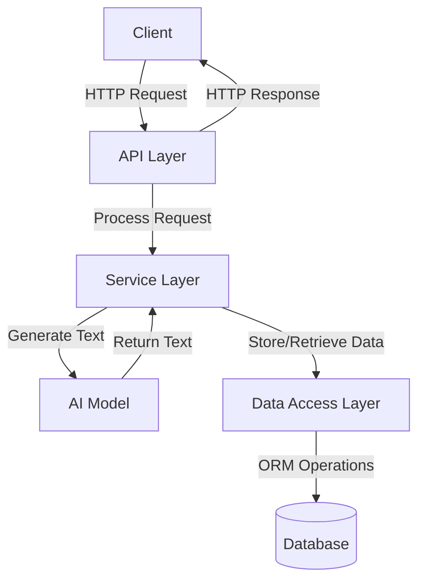
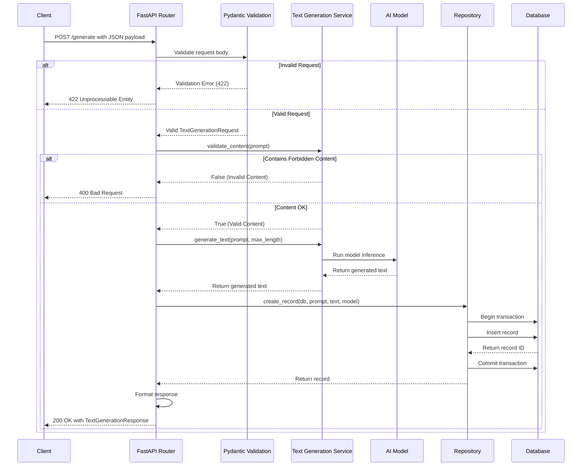

# Integrating Databases into AI Services

## Background 
AI services often need to store inputs (e.g., user prompts), outputs (e.g., generated text), or metadata (e.g., request timestamps) for analytics, auditing, or personalization. This project will focuses on integrating a database with a FastAPI-based AI service to persist data from a generative model, such as Hugging Face’s GPT-2. We’ll use SQLite for simplicity, but the principles apply to other databases like PostgreSQL or MongoDB. FastAPI’s async capabilities and SQLAlchemy’s ORM make database integration seamless, while Pydantic ensures type-safe data handling. This guide assumes familiarity with Python, FastAPI, and AI model integration. We’ll store AI-generated text and metadata, enabling features like history tracking or analytics.

**Why Database Integration Matters**:
- **Persistence**: Store AI inputs/outputs for later use or analysis.
- **Scalability**: Handle large datasets with efficient queries.
- **Flexibility**: Enable features like user history, analytics, or caching.
- **Real-World Use**: Power chatbots with conversation history or content generation platforms with audit trails.


---

## Integrating a Database into a FastAPI AI Service

**Objective**: Build a FastAPI service that integrates a generative AI model (GPT-2) with SQLite to store and retrieve text generation requests and outputs.

**Libs**:
- Python 3.9+ (the base for our recipe)
- FastAPI (for the API framework)
- Uvicorn (ASGI server)
- Hugging Face Transformers (for the AI model)
- Torch (for model computation)
- Pydantic (for data validation)
- SQLAlchemy (for database ORM)
- Optional: Pytest (for testing)

**Tools**:
- Terminal or command line
- Code editor (e.g., VS Code)
- Virtual environment (to keep dependencies clean)
- SQLite (built into Python, no separate installation needed)


---
## Architecture

The system follows a layered architecture with clear separation of concerns:

1. **API Layer**: Handles HTTP requests/responses using FastAPI
2. **Service Layer**: Contains business logic for text generation and content filtering
3. **Data Access Layer**: Manages database operations using SQLAlchemy ORM
4. **Model Layer**: Defines data structures using Pydantic and SQLAlchemy models



### Request Flow Diagram

The following diagram illustrates the detailed flow of a text generation request through each component of the system:


1. Initial request validation using Pydantic
2. Content filtering in the service layer
3. Text generation using the AI model
4. Database transaction for storing the record
5. Response formatting and delivery
6. Error handling at each step

---

## Step 1: Project Environment


**Instructions**:
1. Create a project directory:
   ```bash
   mkdir ai-database-service
   cd ai-database-service
   ```

2. Set up a virtual environment:
   ```bash
   python -m venv venv
   source venv/bin/activate  # Windows: venv\Scripts\activate
   ```

3. Install required packages:
   ```bash
   pip install fastapi uvicorn pydantic transformers torch sqlalchemy pytest httpx
   ```

4. Save dependencies to a `requirements.txt` file:
   ```bash
   pip freeze > requirements.txt
   ```

**What You Get**:

fastapi==0.115.0
uvicorn==0.30.6
pydantic==2.9.2
transformers==4.44.2
torch==2.4.1
sqlalchemy==2.0.35
pytest==8.3.2
httpx==0.27.2


**Tip**: SQLite is used here for simplicity, but you can swap it for PostgreSQL or MySQL by installing the appropriate driver (e.g., `psycopg2` for PostgreSQL).

---

## Step 2:Define Pydantic and SQLAlchemy Models

Pydantic models validate API inputs/outputs, while SQLAlchemy models define the database schema.

**Instructions**:
1. Create a `models.py` file.
2. Define Pydantic models for API requests/responses and SQLAlchemy models for database storage.

**Code Example**:
```python
from pydantic import BaseModel, Field
from typing import Optional
from sqlalchemy import Column, Integer, String, DateTime
from sqlalchemy.ext.declarative import declarative_base
from datetime import datetime

# SQLAlchemy Base
Base = declarative_base()

# SQLAlchemy Model for Database
class GenerationRecord(Base):
    __tablename__ = "generation_records"
    id = Column(Integer, primary_key=True, index=True)
    prompt = Column(String, nullable=False)
    generated_text = Column(String, nullable=False)
    model_name = Column(String, nullable=False)
    created_at = Column(DateTime, default=datetime.utcnow)

# Pydantic Models for API
class TextGenerationRequest(BaseModel):
    prompt: str = Field(..., min_length=1, max_length=500, description="Input prompt for text generation")
    max_length: Optional[int] = Field(50, ge=10, le=200, description="Maximum length of generated text")

class TextGenerationResponse(BaseModel):
    id: int = Field(..., description="Database record ID")
    generated_text: str = Field(..., description="Text generated by the AI model")
    model_name: str = Field(..., description="Name of the AI model used")
    created_at: str = Field(..., description="Timestamp of record creation")
```


- `GenerationRecord` defines the SQLite table schema with fields for prompt, generated text, model name, and timestamp.
- `TextGenerationRequest` validates API inputs.
- `TextGenerationResponse` formats database records for API responses.

---

## Step 3: Database Configuration


**Instructions**:
1. Create a `database.py` file to set up SQLAlchemy’s engine and session.
2. Initialize the SQLite database.

**Code Example**:
```python
from sqlalchemy import create_engine
from sqlalchemy.orm import sessionmaker
from models import Base

# SQLite database (file-based)
DATABASE_URL = "sqlite:///ai_service.db"

# Create engine
engine = create_engine(DATABASE_URL, connect_args={"check_same_thread": False})

# Create session factory
SessionLocal = sessionmaker(autocommit=False, autoflush=False, bind=engine)

# Create tables
Base.metadata.create_all(bind=engine)

def get_db():
    db = SessionLocal()
    try:
        yield db
    finally:
        db.close()
```


- `DATABASE_URL` specifies SQLite (file-based database stored as `ai_service.db`).
- `check_same_thread=False` is SQLite-specific to allow multi-threaded access.
- `get_db` provides a database session for dependency injection.

---

## Step 4: FastAPI with Database and AI Integration

Combining FastAPI, SQLAlchemy, and the AI model creates a service that generates and stores text.

**Instructions**:
1. Create a `main.py` file.
2. Set up a FastAPI app with an endpoint to generate text, store it in the database, and retrieve past records.

**Code Example**:
```python
from fastapi import FastAPI, HTTPException, Depends
from sqlalchemy.orm import Session
from models import TextGenerationRequest, TextGenerationResponse, GenerationRecord
from database import get_db
from transformers import pipeline
from concurrent.futures import ThreadPoolExecutor
import logging

# Configure logging
logging.basicConfig(level=logging.INFO)
logger = logging.getLogger(__name__)

app = FastAPI(title="AI Database Service", version="1.0.0")
generator = pipeline("text-generation", model="gpt2")
executor = ThreadPoolExecutor(max_workers=4)
FORBIDDEN_WORDS = ["hate", "violence"]

def run_model_inference(prompt: str, max_length: int) -> str:
    result = generator(prompt, max_length=max_length, num_return_sequences=1)
    return result[0]["generated_text"]

@app.post("/generate", response_model=TextGenerationResponse)
async def generate_text(request: TextGenerationRequest, db: Session = Depends(get_db)):
    # Content filtering
    if any(word in request.prompt.lower() for word in FORBIDDEN_WORDS):
        logger.warning(f"Rejected prompt: {request.prompt}")
        raise HTTPException(status_code=400, detail="Prompt contains inappropriate content")
    
    try:
        # Run inference in thread pool
        generated_text = await app.state.loop.run_in_executor(
            executor, run_model_inference, request.prompt, request.max_length
        )
        
        # Store in database
        record = GenerationRecord(
            prompt=request.prompt,
            generated_text=generated_text,
            model_name="gpt2"
        )
        db.add(record)
        db.commit()
        db.refresh(record)
        
        logger.info(f"Stored record ID {record.id} for prompt: {request.prompt[:20]}...")
        
        return TextGenerationResponse(
            id=record.id,
            generated_text=record.generated_text,
            model_name=record.model_name,
            created_at=record.created_at.isoformat()
        )
    except Exception as e:
        logger.error(f"Inference or database error: {str(e)}")
        raise HTTPException(status_code=500, detail=f"Error: {str(e)}")

@app.get("/history/{record_id}", response_model=TextGenerationResponse)
async def get_history(record_id: int, db: Session = Depends(get_db)):
    record = db.query(GenerationRecord).filter(GenerationRecord.id == record_id).first()
    if not record:
        raise HTTPException(status_code=404, detail="Record not found")
    
    return TextGenerationResponse(
        id=record.id,
        generated_text=record.generated_text,
        model_name=record.model_name,
        created_at=record.created_at.isoformat()
    )

@app.on_event("startup")
async def startup_event():
    app.state.loop = app.state.loop or __import__("asyncio").get_event_loop()
    logger.info("FastAPI app started with thread pool")

@app.on_event("shutdown")
async def shutdown_event():
    executor.shutdown(wait=True)
    logger.info("Thread pool shutdown")
```


- The `/generate` endpoint generates text, stores it in SQLite, and returns the record.
- The `/history/{record_id}` endpoint retrieves past records by ID.
- `Depends(get_db)` injects a database session for each request.
- FastAPI automatically runs synchronous endpoint handlers (like ours) in a thread pool, so we don't need to manage our own `ThreadPoolExecutor`.

---

## Step 5: Run the FastAPI Server


**Instructions**:
1. Start the server with Uvicorn:
   ```bash
   uvicorn main:app --host 0.0.0.0 --port 8000
   ```

2. Visit `http://127.0.0.1:8000/docs` for Swagger UI to test the API.

**Try It Out**:
Test the `/generate` endpoint with `curl`:
```bash
curl -X POST "http://127.0.0.1:8000/generate" -H "Content-Type: application/json" -d '{"prompt": "The future of AI is", "max_length": 50}'
```

**Expected Result**:
```json
{
  "id": 1,
  "generated_text": "The future of AI is bright, with machines creating innovative solutions...",
  "model_name": "gpt2",
  "created_at": "2025-07-13T12:00:00"
}
```

Retrieve the record:
```bash
curl "http://127.0.0.1:8000/history/1"
```

**Pro Tip**: The SQLite database (`ai_service.db`) is created automatically in the project directory.

---

## Step 6: Content Filtering and Logging

Content filtering and logging make your service safe and debuggable.

**Instructions**:
1. The `main.py` above includes content filtering (`FORBIDDEN_WORDS`) and logging.
2. Enhance logging to track database operations.

**Test**:
- Prompts with “hate” or “violence” return a 400 error.
- Logs track prompt rejections, database storage, and errors.

---

## Step 7: Test the Service


**Instructions**:
1. Create a `test_main.py` file to test the API.
2. Use `pytest` and `httpx` for HTTP testing.

**Code Example**:
```python
import pytest
import httpx
from fastapi.testclient import TestClient
from main import app

client = TestClient(app)

def test_generate_text_and_store():
    response = client.post("/generate", json={"prompt": "Test prompt", "max_length": 50})
    assert response.status_code == 200
    data = response.json()
    assert "id" in data
    assert "generated_text" in data
    assert data["model_name"] == "gpt2"
    assert "created_at" in data
    
    # Verify history retrieval
    record_id = data["id"]
    history_response = client.get(f"/history/{record_id}")
    assert history_response.status_code == 200
    assert history_response.json()["id"] == record_id

def test_generate_text_invalid_prompt():
    response = client.post("/generate", json={"prompt": "", "max_length": 50})
    assert response.status_code == 422  # Pydantic validation error

def test_generate_text_forbidden_words():
    response = client.post("/generate", json={"prompt": "I hate this", "max_length": 50})
    assert response.status_code == 400
    assert "inappropriate content" in response.json()["detail"]

def test_history_not_found():
    response = client.get("/history/999")
    assert response.status_code == 404
    assert "not found" in response.json()["detail"]
```

3. Run the tests:
   ```bash
   pytest test_main.py
   ```

**Expected Result**:
```
===================================== test session starts ======================================
collected 4 items

test_main.py ....                                                                [100%]

===================================== 4 passed in 2.30s ======================================
```

**Pro Tip**: Tests verify text generation, database storage, history retrieval, and error handling.

---

## Step 8: Deploy the Service

Deployment makes your AI service with database integration accessible.

**Instructions**:
1. Create a `Procfile` for deployment (e.g., on Render):

web: uvicorn main:app --host 0.0.0.0 --port $PORT --workers 4


2. Deploy to a platform like Render, ensuring `requirements.txt` is included.
3. For production, consider a managed database like PostgreSQL (update `DATABASE_URL` in `database.py`).

**Command** (Render CLI example):
```bash
render deploy
```

**Pro Tip**: Use environment variables (e.g., via `python-dotenv`) for `DATABASE_URL` in production.

---

## Tips
- **Choose the Right Database**: SQLite is great for development, but switch to PostgreSQL or MySQL for production scalability.
- **Optimize Queries**: Index frequently queried fields (e.g., `created_at`) for faster retrieval.
- **Scale with APIs**: For heavy AI workloads, consider API  to offload model hosting.
- **Monitor Performance**: Use Prometheus to track API and database performance.
- **Secure Data**: Encrypt sensitive fields (e.g., prompts) if storing user data.

---

## Project Structure
```
ai-database-service/
├── main.py
├── models.py
├── database.py
├── test_main.py
├── requirements.txt
├── Procfile
├── ai_service.db (generated by SQLite)
└── venv/
```

---
