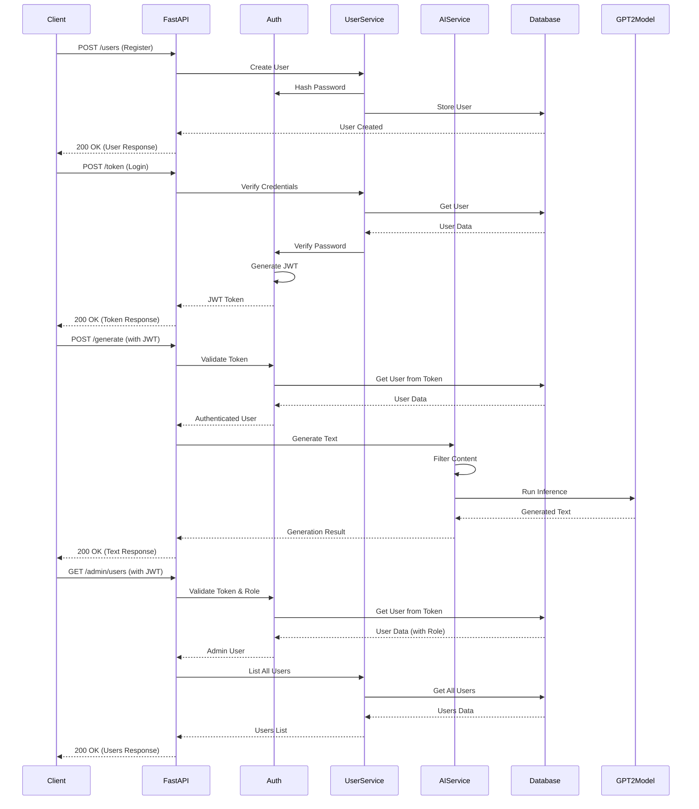

# Securing AI Services with Authentication and Authorization

## Background
Authentication (verifying who a user is) and authorization (determining what a user can do) are critical for protecting AI services, especially when handling sensitive data like user prompts or generated outputs. This project will focuses on securing a FastAPI-based AI service using JWT (JSON Web Tokens) for authentication and role-based authorization to control access to endpoints. We’ll integrate a generative AI model (Hugging Face’s GPT-2) with FastAPI, secure it with JWT-based authentication, and enforce user roles (e.g., `user` and `admin`). This guide assumes familiarity with Python, FastAPI, and AI model integration. We’ll use `python-jose` for JWT handling, `passlib` for password hashing, and SQLite for user storage, but the concepts apply to other databases or auth methods.

**Why Authentication and Authorization Matter**:
- **Security**: Protect your AI service from unauthorized access.
- **Granularity**: Control access to specific endpoints based on user roles.
- **Scalability**: JWTs are stateless, making them ideal for distributed systems.
- **Real-World Use**: Secure chatbots, content generators, or API services with user-specific access.

Ready to lock down your AI service? Let’s fire up the stove!

---

## Securing a FastAPI AI Service with Authentication and Authorization

**Objective**: Build a FastAPI service that integrates a generative AI model (GPT-2), secures it with JWT authentication, and enforces role-based authorization.

**Libs**:
- Python 3.9+ (the base for our recipe)
- FastAPI (for the API framework)
- Uvicorn (ASGI server)
- Hugging Face Transformers (for the AI model)
- Torch (for model computation)
- Pydantic (for data validation)
- SQLAlchemy (for user database)
- `python-jose[cryptography]` (for JWT handling)
- `passlib[bcrypt]` (for password hashing)
- Optional: Pytest and `httpx` (for testing)

**Tools**:
- Terminal or command line
- Code editor (e.g., VS Code)
- Virtual environment (to keep dependencies clean)
- SQLite (built into Python)


---

### Request Flow Diagram


---

## Step 1: Project Environment


**Instructions**:
1. Create a project directory:
   ```bash
   mkdir ai-auth-service
   cd ai-auth-service
   ```

2. Set up a virtual environment:
   ```bash
   python -m venv venv
   source venv/bin/activate  # Windows: venv\Scripts\activate
   ```

3. Install required packages:
   ```bash
   pip install fastapi uvicorn pydantic transformers torch sqlalchemy python-jose[cryptography] passlib[bcrypt] pytest httpx
   ```

4. Save dependencies to a `requirements.txt` file:
   ```bash
   pip freeze > requirements.txt
   ```

**What You Get**:

```
fastapi==0.115.0
uvicorn==0.30.6
pydantic==2.9.2
transformers==4.44.2
torch==2.7.1
sqlalchemy==2.0.35
python-jose[cryptography]==3.3.0
passlib[bcrypt]==1.7.4
pytest==8.3.2
httpx==0.27.2
passlib[bcrypt]         # <-- This is the key for the bcrypt fix
torch                   # <-- transformers needs either torch or tensorflow
python-multipart        # <-- Needed for form data like in your /token endpoint
```


**Pro Tip**: The `python-jose[cryptography]` and `passlib[bcrypt]` extras ensure secure JWT handling and password hashing.

---

## Step 2: Define Pydantic and SQLAlchemy Models

Pydantic models validate API inputs/outputs, while SQLAlchemy models define the user database schema.

**Instructions**:
1. Create a `models.py` file.
2. Define Pydantic models for authentication, authorization, and AI requests, plus SQLAlchemy models for users.

**Code Example**:
```python
from pydantic import BaseModel, Field
from typing import Optional
from sqlalchemy import Column, Integer, String, Enum
from sqlalchemy.ext.declarative import declarative_base
import enum

# SQLAlchemy Base
Base = declarative_base()


# User Roles
class Role(enum.Enum):
    user = "user"
    admin = "admin"


# SQLAlchemy Model for Users
class User(Base):
    __tablename__ = "users"
    id = Column(Integer, primary_key=True, index=True)
    username = Column(String, unique=True, index=True, nullable=False)
    hashed_password = Column(String, nullable=False)
    role = Column(Enum(Role), default=Role.user, nullable=False)


# Pydantic Models for API
class UserCreate(BaseModel):
    username: str = Field(
        ..., min_length=3, max_length=50, description="User's username"
    )
    password: str = Field(..., min_length=6, description="User's password")
    role: Role = Field(Role.user, description="User's role")


class UserResponse(BaseModel):
    id: int
    username: str
    role: Role


class Token(BaseModel):
    access_token: str
    token_type: str


class TextGenerationRequest(BaseModel):
    prompt: str = Field(
        ...,
        min_length=1,
        max_length=500,
        description="Input prompt for text generation",
    )
    max_length: Optional[int] = Field(
        50, ge=10, le=200, description="Maximum length of generated text"
    )


class TextGenerationResponse(BaseModel):
    generated_text: str = Field(..., description="Text generated by the AI model")
    model: str = Field(..., description="Name of the AI model used")
```


- `User` defines the database schema for storing usernames, hashed passwords, and roles.
- `UserCreate` and `UserResponse` handle user registration and responses.
- `Token` defines the JWT response format.
- `TextGenerationRequest` and `TextGenerationResponse` manage AI requests.

---

## Step 3: Database and Auth Configuration


**Instructions**:
1. Create a `database.py` file for SQLAlchemy setup.
2. Create an `auth.py` file for JWT handling and password hashing.

**Code Example (Database)**:
```python
from sqlalchemy import create_engine
from sqlalchemy.orm import sessionmaker
from models import Base

DATABASE_URL = "sqlite:///ai_auth.db"
engine = create_engine(DATABASE_URL, connect_args={"check_same_thread": False})
SessionLocal = sessionmaker(autocommit=False, autoflush=False, bind=engine)

Base.metadata.create_all(bind=engine)

def get_db():
    db = SessionLocal()
    try:
        yield db
    finally:
        db.close()
```

**Code Example (Auth)**:
```python
from fastapi import Depends, HTTPException, status
from fastapi.security import OAuth2PasswordBearer
from jose import JWTError, jwt
from passlib.context import CryptContext
from sqlalchemy.orm import Session
from models import User, UserResponse
from datetime import datetime, timedelta
from database import get_db
import os

# JWT settings
SECRET_KEY = os.environ.get("SECRET_KEY", "your-secret-key")  # Set in production
ALGORITHM = "HS256"
ACCESS_TOKEN_EXPIRE_MINUTES = 30

# Password hashing
pwd_context = CryptContext(schemes=["bcrypt"], deprecated="auto")
oauth2_scheme = OAuth2PasswordBearer(tokenUrl="token")

def verify_password(plain_password, hashed_password):
    return pwd_context.verify(plain_password, hashed_password)

def get_password_hash(password):
    return pwd_context.hash(password)

def create_access_token(data: dict):
    to_encode = data.copy()
    expire = datetime.utcnow() + timedelta(minutes=ACCESS_TOKEN_EXPIRE_MINUTES)
    to_encode.update({"exp": expire})
    return jwt.encode(to_encode, SECRET_KEY, algorithm=ALGORITHM)

def get_user(db: Session, username: str):
    return db.query(User).filter(User.username == username).first()

async def get_current_user(token: str = Depends(oauth2_scheme), db: Session = Depends(get_db)):
    credentials_exception = HTTPException(
        status_code=status.HTTP_401_UNAUTHORIZED,
        detail="Could not validate credentials",
        headers={"WWW-Authenticate": "Bearer"},
    )
    try:
        payload = jwt.decode(token, SECRET_KEY, algorithms=[ALGORITHM])
        username: str = payload.get("sub")
        if username is None:
            raise credentials_exception
    except JWTError:
        raise credentials_exception
    user = get_user(db, username)
    if user is None:
        raise credentials_exception
    return user

async def get_current_admin(user: User = Depends(get_current_user)):
    if user.role != "admin":
        raise HTTPException(status_code=403, detail="Admin access required")
    return user
```

- `database.py` sets up SQLite (`ai_auth.db`) and a session factory.
- `auth.py` handles password hashing, JWT creation, and user authentication.
- `get_current_user` verifies JWTs, and `get_current_admin` enforces admin-only access.

---

## Step 4: FastAPI with Auth and AI Integration

Combining authentication, authorization, and AI creates a secure, role-based service.

**Instructions**:
1. Create a `main.py` file.
2. Set up FastAPI endpoints for user registration, login, and secured AI text generation.

**Code Example**:
```python
from fastapi import FastAPI, Depends, HTTPException, status
from fastapi.security import OAuth2PasswordRequestForm
from sqlalchemy.orm import Session
from models import (
    User,
    UserCreate,
    UserResponse,
    TextGenerationRequest,
    TextGenerationResponse,
    Token,
)
from database import get_db
from auth import (
    verify_password,
    get_password_hash,
    create_access_token,
    get_current_user,
    get_current_admin,
)
from transformers import pipeline
from concurrent.futures import ThreadPoolExecutor
import logging
import asyncio

# Configure logging
logging.basicConfig(level=logging.INFO)
logger = logging.getLogger(__name__)

app = FastAPI(title="Secure AI Service", version="1.0.0")
generator = pipeline("text-generation", model="gpt2")
executor = ThreadPoolExecutor(max_workers=4)
FORBIDDEN_WORDS = ["hate", "violence"]


def run_model_inference(prompt: str, max_length: int) -> str:
    result = generator(prompt, max_length=max_length, num_return_sequences=1)
    return result[0]["generated_text"]


@app.post("/users", response_model=UserResponse)
async def create_user(user: UserCreate, db: Session = Depends(get_db)):
    db_user = db.query(User).filter(User.username == user.username).first()
    if db_user:
        raise HTTPException(status_code=400, detail="Username already registered")
    hashed_password = get_password_hash(user.password)
    db_user = User(
        username=user.username, hashed_password=hashed_password, role=user.role
    )
    db.add(db_user)
    db.commit()
    db.refresh(db_user)
    logger.info(f"Created user: {user.username}")
    return UserResponse(id=db_user.id, username=db_user.username, role=db_user.role)


@app.post("/token", response_model=Token)
async def login(
    form_data: OAuth2PasswordRequestForm = Depends(), db: Session = Depends(get_db)
):
    user = db.query(User).filter(User.username == form_data.username).first()
    if not user or not verify_password(form_data.password, user.hashed_password):
        raise HTTPException(
            status_code=status.HTTP_401_UNAUTHORIZED,
            detail="Incorrect username or password",
            headers={"WWW-Authenticate": "Bearer"},
        )
    access_token = create_access_token(data={"sub": user.username})
    logger.info(f"User {user.username} logged in")
    return {"access_token": access_token, "token_type": "bearer"}


@app.post("/generate", response_model=TextGenerationResponse)
async def generate_text(
    request: TextGenerationRequest,
    user: User = Depends(get_current_user),
    db: Session = Depends(get_db),
):
    if any(word in request.prompt.lower() for word in FORBIDDEN_WORDS):
        logger.warning(f"User {user.username} sent forbidden prompt: {request.prompt}")
        raise HTTPException(
            status_code=400, detail="Prompt contains inappropriate content"
        )

    try:
        generated_text = await app.state.loop.run_in_executor(
            executor, run_model_inference, request.prompt, request.max_length
        )
        logger.info(f"Generated text for user {user.username}")
        # --- MODIFIED LINE TO MATCH MODEL CHANGE ---
        return TextGenerationResponse(generated_text=generated_text, model="gpt2")
    except Exception as e:
        logger.error(f"Inference failed for user {user.username}: {str(e)}")
        raise HTTPException(status_code=500, detail=f"Model inference failed: {str(e)}")


@app.get("/admin/users", response_model=list[UserResponse])
async def list_users(
    user: User = Depends(get_current_admin), db: Session = Depends(get_db)
):
    users = db.query(User).all()
    logger.info(f"Admin {user.username} accessed user list")
    return [UserResponse(id=u.id, username=u.username, role=u.role) for u in users]


# --- START: MODIFIED STARTUP/SHUTDOWN EVENTS ---
@app.on_event("startup")
async def startup_event():
    # Correctly get and assign the event loop
    app.state.loop = asyncio.get_event_loop()
    logger.info("FastAPI app started with thread pool")


@app.on_event("shutdown")
async def shutdown_event():
    executor.shutdown(wait=True)
    logger.info("Thread pool shutdown")


# --- END: MODIFIED STARTUP/SHUTDOWN EVENTS ---
```

- `/users`: Registers new users with hashed passwords.
- `/token`: Authenticates users and returns a JWT.
- `/generate`: Secured endpoint for text generation, accessible to authenticated users.
- `/admin/users`: Admin-only endpoint to list users, protected by `get_current_admin`.
- `ThreadPoolExecutor` offloads CPU-bound inference.

---

## Step 5: Run the FastAPI Server

**Instructions**:
1. Set the `SECRET_KEY` environment variable:
   ```bash
   export SECRET_KEY="your-secure-secret-key"  # Windows: set SECRET_KEY=your-secure-secret-key
   ```

2. Start the server with Uvicorn:
   ```bash
   uvicorn main:app --host 0.0.0.0 --port 8000
   ```

3. Visit `http://127.0.0.1:8000/docs` for Swagger UI to test the API.

**Try It Out**:
1. Register a user:
   ```bash
   curl -X POST "http://127.0.0.1:8000/users" -H "Content-Type: application/json" -d '''{"username": "testuser", "password": "securepassword", "role": "user"}'''
   ```

2. Get a token:
   ```bash
   curl -X POST "http://127.0.0.1:8000/token" -H "Content-Type: application/x-www-form-urlencoded" -d "username=testuser&password=securepassword"
   ```

3. Use the token to generate text:
   ```bash
   curl -X POST "http://127.0.0.1:8000/generate" -H "Authorization: Bearer <your-token>" -H "Content-Type: application/json" -d '''{"prompt": "The future of AI is", "max_length": 50}'''
   ```

**Expected Result**:
```json
{
  "generated_text": "The future of AI is bright, with machines creating innovative solutions...",
  "model_name": "gpt2"
}
```

**Pro Tip**: Use Swagger UI’s “Authorize” button to input the JWT for easier testing.

---

## Step 6: Content Filtering and Logging

Content filtering and logging ensure security and debuggability.

**Instructions**:
1. The `main.py` above includes content filtering (`FORBIDDEN_WORDS`) and logging.
2. Logs track user actions (registration, login, inference) for auditing.

**Taste Test**:
- Prompts with “hate” or “violence” return a 400 error.
- Logs help trace user activity and errors.

---

## Step 7: Test the Service


**Instructions**:
1. Create a `test_main.py` file to test the API.
2. Use `pytest` and `httpx` for HTTP testing.

**Code Example**:
```python
import pytest
import httpx
from fastapi.testclient import TestClient
from main import app

client = TestClient(app)

def test_create_user_and_generate():
    # Create user
    response = client.post("/users", json={"username": "testuser", "password": "securepassword", "role": "user"})
    assert response.status_code == 200
    assert response.json()["username"] == "testuser"
    
    # Login
    response = client.post("/token", data={"username": "testuser", "password": "securepassword"})
    assert response.status_code == 200
    token = response.json()["access_token"]
    
    # Generate text
    response = client.post(
        "/generate",
        json={"prompt": "Test prompt", "max_length": 50},
        headers={"Authorization": f"Bearer {token}"}
    )
    assert response.status_code == 200
    assert "generated_text" in response.json()
    assert response.json()["model_name"] == "gpt2"

def test_unauthorized_access():
    response = client.post("/generate", json={"prompt": "Test prompt", "max_length": 50})
    assert response.status_code == 401
    assert "Not authenticated" in response.json()["detail"]

def test_admin_endpoint_access():
    # Create admin user
    response = client.post("/users", json={"username": "adminuser", "password": "adminpassword", "role": "admin"})
    assert response.status_code == 200
    
    # Login as admin
    response = client.post("/token", data={"username": "adminuser", "password": "adminpassword"})
    token = response.json()["access_token"]
    
    # Access admin endpoint
    response = client.get("/admin/users", headers={"Authorization": f"Bearer {token}"})
    assert response.status_code == 200
    assert isinstance(response.json(), list)

def test_non_admin_access_denied():
    # Login as regular user
    response = client.post("/token", data={"username": "testuser", "password": "securepassword"})
    token = response.json()["access_token"]
    
    # Try accessing admin endpoint
    response = client.get("/admin/users", headers={"Authorization": f"Bearer {token}"})
    assert response.status_code == 403
    assert "Admin access required" in response.json()["detail"]
```

3. Run the tests:
   ```bash
   pytest test_main.py
   ```

**Expected Result**:
```
===================================== test session starts ======================================
collected 4 items

test_main.py ....                                                                [100%]

===================================== 4 passed in 2.50s ======================================
```

**Pro Tip**: Tests verify user creation, login, text generation, and role-based access control.

---

## Step 8: Deploy the Service

**Why**: Deployment makes your secure AI service accessible, like serving a dish to a global audience.

**Instructions**:
1. Create a `Procfile` for deployment (e.g., on Render):

web: uvicorn main:app --host 0.0.0.0 --port $PORT --workers 4


2. Deploy to a platform like Render, ensuring `requirements.txt` is included.
3. Set the `SECRET_KEY` environment variable in production:
   ```bash
   export SECRET_KEY="your-secure-secret-key"
   ```

**Command** (Render CLI example):
```bash
render deploy
```

**Pro Tip**: Use a strong, random `SECRET_KEY` in production and store it securely (e.g., via `python-dotenv`).

---

## Tips
- **Secure JWTs**: Use a long, random `SECRET_KEY` and consider refresh tokens for longer sessions.
- **Database Choice**: SQLite is great for development; switch to PostgreSQL for production scalability.
- **Scale AI**: For heavy workloads, use API to offload model hosting.
- **Monitor Security**: Use tools like Prometheus to track authentication failures or suspicious activity.
- **Enhance Auth**: Add OAuth2 providers (e.g., Google) for easier user management.

---

## Project Structure
```
ai-auth-service/
├── main.py
├── models.py
├── database.py
├── auth.py
├── test_main.py
├── requirements.txt
├── Procfile
├── ai_auth.db (generated by SQLite)
└── venv/
```

---

